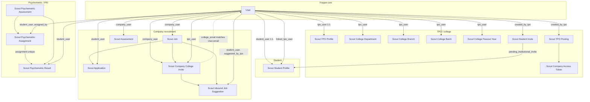
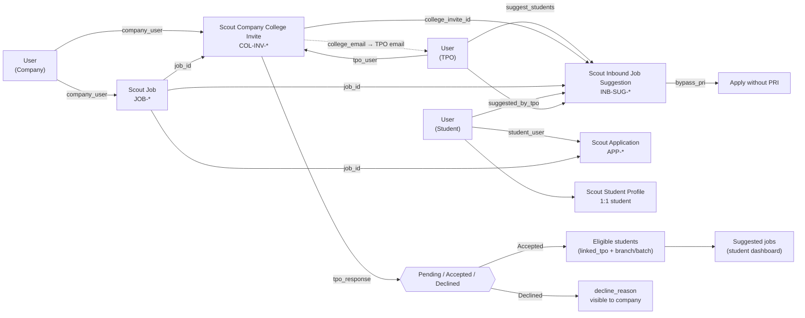

# Scout Express — Database schema & relationships

This document describes how Scout custom **DocTypes** relate to each other in Frappe/MariaDB.  
Solid lines = **Link** fields (foreign keys). Dashed lines = **logical** matches in application code (email / text).

**Print tip:** Open this file in VS Code / Cursor preview or export to PDF via *Print → Save as PDF*.

---

## 1. High-level architecture



---

## 2. Entity-relationship diagram (all Scout DocTypes)

```mermaid
erDiagram
  User ||--o| Scout_TPO_Profile : "tpo_user PK"
  User ||--o{ Scout_College_Department : "tpo_user"
  User ||--o{ Scout_College_Branch : "tpo_user"
  User ||--o{ Scout_College_Batch : "tpo_user"
  User ||--o{ Scout_College_Passout_Year : "tpo_user"
  User ||--o{ Scout_TPO_Posting : "created_by_tpo"
  User ||--o{ Scout_Student_Invite : "created_by_tpo"
  User ||--o| Scout_Student_Profile : "student_user PK"
  User ||--o| Scout_Student_Profile : "linked_tpo_user"
  User ||--o{ Scout_Job : "company_user"
  User ||--o{ Scout_Application : "student_user"
  User ||--o{ Scout_Assessment : "company_user"
  User ||--o{ Scout_Company_College_Invite : "company_user"
  User ||--o{ Scout_Company_College_Invite : "tpo_user"
  User ||--o{ Scout_Inbound_Job_Suggestion : "student_user"
  User ||--o{ Scout_Inbound_Job_Suggestion : "suggested_by_tpo"
  User ||--o{ Scout_Psychometric_Assignment : "student_user"
  User ||--o{ Scout_Psychometric_Assignment : "assigned_by"
  User ||--o{ Scout_Psychometric_Result : "student_user"
  User ||--o{ Scout_Psychometric_Assessment : "created_by_admin"

  Scout_Student_Invite ||--o| Scout_Student_Profile : "pending_institutional_invite"
  Scout_Job ||--o{ Scout_Application : "job_id"
  Scout_Job ||--o{ Scout_Company_College_Invite : "job_id"
  Scout_Job ||--o{ Scout_Inbound_Job_Suggestion : "job_id"
  Scout_Company_College_Invite ||--o{ Scout_Inbound_Job_Suggestion : "college_invite_id"
  Scout_TPO_Posting ||--o{ Scout_Company_Access_Token : "posting_id"
  Scout_Psychometric_Assessment ||--o{ Scout_Psychometric_Assignment : "psychometric_assessment"
  Scout_Psychometric_Assignment ||--o| Scout_Psychometric_Result : "assignment unique"
  Scout_Psychometric_Assessment ||--o{ Scout_Psychometric_Result : "psychometric_assessment"
```



---

## 3. Inbound jobs slice (focused)

Company requests recruitment from a college → TPO accepts/declines → students see suggested jobs.



### Inbound jobs — field reference

| DocType | Key fields | Notes |
|---------|------------|--------|
| **Scout Company College Invite** | `company_user`, `job_id`, `college_email`, `tpo_user`, `tpo_response`, `recruitment_stage`, `application_deadline`, `eligibility_*`, `decline_reason` | Created when company invites a college |
| **Scout Inbound Job Suggestion** | `college_invite_id`, `job_id`, `student_user`, `suggested_by_tpo`, `bypass_pri` | TPO manual suggest; independent of PRI |
| **Scout Job** | `company_user`, title, skills, status, … | Company posting |
| **Scout Application** | `job_id`, `student_user`, `application_status` | Student applies after eligibility / suggest |
| **Scout Student Profile** | `student_user`, `linked_tpo_user`, `college`, `pri_score`, branch/batch text | Eligibility & PRI checks |

### Inbound lifecycle

1. **Company** sends invite → row in `Scout Company College Invite` (`tpo_response = Pending`).
2. System sets `tpo_user` by matching `college_email` to TPO **User** email (and/or TPO profile).
3. **TPO** accepts or declines (`decline_reason` stored if declined).
4. **Accepted:** eligible students get job in **Suggested jobs**; TPO can add **Scout Inbound Job Suggestion** rows.
5. **Student** applies → **Scout Application** (PRI bypass if suggested with `bypass_pri`).
6. **Company** reads `tpo_response`, `decline_reason`, `recruitment_stage` on invite history.

---

## 4. DocType catalog

| DocType | MariaDB table | Primary key | Main links |
|---------|---------------|-------------|------------|
| User | `tabUser` | name (email) | Frappe auth |
| Scout TPO Profile | `tabScout TPO Profile` | `tpo_user` | → User |
| Scout College Department | `tabScout College Department` | hash | → User (`tpo_user`) |
| Scout College Branch | `tabScout College Branch` | hash | → User (`tpo_user`) |
| Scout College Batch | `tabScout College Batch` | hash | → User (`tpo_user`) |
| Scout College Passout Year | `tabScout College Passout Year` | hash | → User (`tpo_user`) |
| Scout Student Invite | `tabScout Student Invite` | STU-INV-* | → User (`created_by_tpo`) |
| Scout Student Profile | `tabScout Student Profile` | `student_user` | → User, → Invite, → TPO User |
| Scout TPO Posting | `tabScout TPO Posting` | TPO-* | → User (`created_by_tpo`) |
| Scout Company Access Token | `tabScout Company Access Token` | TOKEN-* | → Scout TPO Posting |
| Scout Job | `tabScout Job` | JOB-* | → User (`company_user`) |
| Scout Application | `tabScout Application` | APP-* | → Scout Job, → User (student) |
| Scout Assessment | `tabScout Assessment` | ASM-* | → User (company) |
| Scout Company College Invite | `tabScout Company College Invite` | COL-INV-* | → User (company, TPO), → Scout Job |
| Scout Inbound Job Suggestion | `tabScout Inbound Job Suggestion` | INB-SUG-* | → Invite, Job, User (student, TPO) |
| Scout Psychometric Assessment | `tabScout Psychometric Assessment` | PSY-ASM-* | → User (admin) |
| Scout Psychometric Assignment | `tabScout Psychometric Assignment` | PSY-ASN-* | → Assessment, User |
| Scout Psychometric Result | `tabScout Psychometric Result` | PSY-RES-* | → Assignment (unique), Assessment, User |

---

## 5. Soft relationships (no Link field)

| From | To | How matched |
|------|-----|-------------|
| `Scout Company College Invite.college_email` | TPO User | Email → `tpo_user` |
| `Scout TPO Profile.college_name` | `Scout Student Profile.college` | Text match for college scope |
| `Scout TPO Posting.company_email` | Company | Email string only |
| Accepted inbound invite | Student suggested jobs | API query on invite + eligibility + suggestions |

---

## 6. Flow summaries

### TPO ↔ students

```
User (TPO) ──1:1── Scout TPO Profile
     ├── Scout Student Invite ──► Scout Student Profile (linked_tpo_user)
     └── College Department / Branch / Batch / Passout Year
```

### Company jobs ↔ students

```
User (Company) ──► Scout Job ──► Scout Application ◄── User (Student)
```

### TPO internal postings (separate from company jobs)

```
User (TPO) ──► Scout TPO Posting ◄── Scout Company Access Token
```

### Psychometric / PRI

```
Scout Psychometric Assessment
     └── Scout Psychometric Assignment
              └── Scout Psychometric Result (1:1 assignment)
Scout Student Profile.pri_score  (aggregated readiness)
```

---

## 7. Source definitions

DocType JSON files live under:

`backend/apps/scout/scout/scout/doctype/<doctype_name>/`

### Payments, credits, HR, community

```
Scout Payment Order          (Razorpay: mock exam, TPO credit packs)
Scout Student Credit Wallet  ◄── User (Student)
Scout Credit Transaction
Scout HR Access Token        (magic link for external HR)
Scout Community Post         (TPO community + public blog)
```

### Calendars & engagement (TPO)

```
Scout Placement Calendar Event
Scout Training Session
Scout Mock Exam ──► Scout Mock Exam Registration ──► Scout Payment Order
Scout Challenge ──► Scout Challenge Application
```

---

Last updated: May 2026 (inbound jobs, calendars, payments, credits, HR tokens, community).
